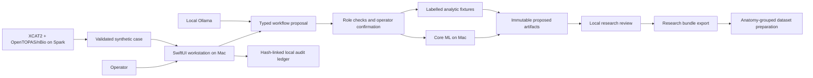

# Architecture and governance boundary

## Modules

`TPSCore` contains the typed volume domain, analytic fixtures, review/export
rules, audit ledger, Core ML runtime and local HTTP/Ollama clients. It has no
dependency on SwiftUI. `GovernedTPS` is a SwiftUI executable with an explicit
application state store. `TPSCheck` exercises the synthetic path without a GUI.

## Roles

| Assistant | Allowed operations |
|---|---|
| Physician | Inspect, contour |
| Physicist | Inspect, dose prediction, synthetic CT |
| Dosimetrist | Inspect, contour, dose prediction |
| Technologist | Inspect, synthetic CT |

These are software capability profiles, not assertions that agents replace
licensed staff. Roles cannot authorize prescription changes, signatures,
clinical acceptance, delivery, arbitrary tools, shell commands or remote code.
The schema contains none of those operations. Execution is one-shot and bound
to the case and role that produced the proposal. LLM prose is displayed as
untrusted explanation, never interpreted as an instruction by the runtime.

## Invariants

1. Every case is explicitly synthetic and has a generator version and recipe.
2. Every volume has finite values, declared units and a bounded spatial grid.
3. Input and output must share dimensions, spacing, origin, direction and frame
   identifier exactly. No implicit resampling or registration occurs.
4. Artifact hashes include source hash, operation, model identity/version,
   geometry, voxel values, structure map and timestamp.
5. Each review binds to that exact artifact. Mutation invalidates review.
6. A later rejection supersedes an earlier research acceptance.
7. Agents create proposals; the application records human research reviews only
   through the explicit operator flow.
8. Research export includes only currently accepted results and always declares
   `clinicalUsePermitted: false`. Predicted artifacts stay separate from source
   labels, reference transport dose and nBio scorer evidence.
9. Dataset splits are assigned by anatomy family, not by image or motion variant.
10. The original repository's application and controlled records are untouched.

## Persistence and trust limits

The workspace is a versioned JSON document, atomically replaced after validated
state changes. Each event links to the preceding SHA-256 hash. This detects
inconsistent edits but is not an immutable, signed or independently anchored
ledger: someone with filesystem access can rewrite a consistent chain or
truncate it. Operator names are unauthenticated local attestations. Encryption,
institutional authentication, RBAC identity binding, signed release evidence,
multi-user concurrency, migrations, recovery history and remote audit anchoring
are not implemented.

All HTTP sessions are ephemeral, have response-size and duration bounds, and
reject redirects. Language-model URLs are loopback-only. The generic Spark
adapter allows explicit private IPs; prefer SSH forwarding so neither sensitive
endpoints nor a generator service are exposed on a LAN. The app itself never
executes shell output from an LLM. A local Ollama administrator remains trusted
to configure locally executed models rather than opaque proxy aliases.

## Scientific and product limits

The fixture uses simplified disjoint geometric regions. Its MR is a synthetic
signal proxy, its contour output is intensity thresholding, its sCT is a crude
signal mapping, and its dose is an analytic Gaussian field. None is a trained
or transport-validated result. DVHs are calculated from those actual voxels,
with inclusive dose thresholds, nearest-rank D95 and voxel-volume weighting;
they carry no clinical acceptance thresholds.

The viewer shows voxel planes. For identity LPS orientation, anatomical labels
are shown; for oblique grids it displays voxel-plane labels without claiming
an anatomical reformat. It does not reslice into world-aligned MPR planes.
Contours are raster-boundary visualizations, not editable RTSTRUCT polygons.

Production TPS work still includes DICOM conformance, independent image/geometry
validation, overlapping ROI representation, beam/MLC/machine modeling, physical
dose calculation, optimization, calibration, plan QA, prescribed fractionation,
clinical identity/signatures and institutional release processes. Those features
must not be inferred from an inference overlay or a successful build.
